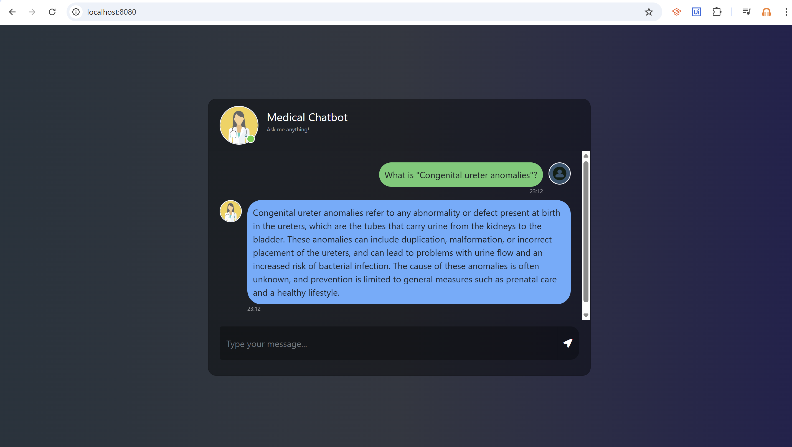
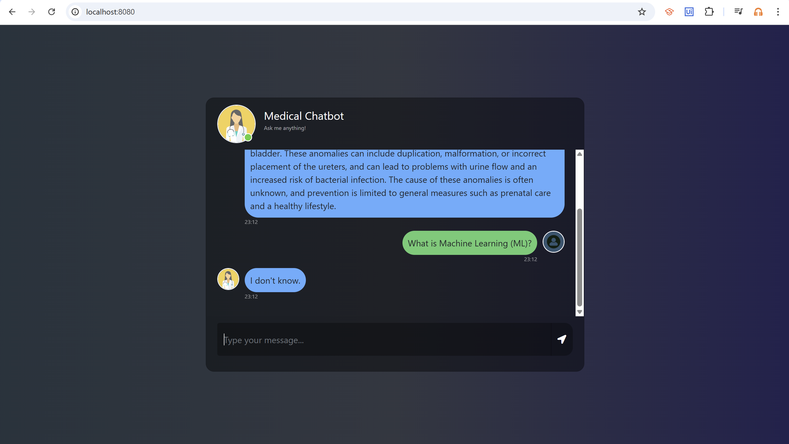

# 🤖 End-to-end-Medical-Chatbot 👨‍⚕️

## Project Overview
This repository contains a **Medical Chatbot** powered by **Retrieval-Augmented Generation (RAG)**. The chatbot is designed to answer medical-related questions based on retrieved context while ensuring accuracy and reliability. If a question is unrelated to medicine, the chatbot responds with "I don't know."

## Features
1. **Medical Specific Question Answering:** Provides responses only for medical, healthcare, and biology-related queries.
2. **Context-Aware Response:** Uses retrieved medical knowledge to generate concise, accurate answers. 
3. **Reliable Uncertainty Handling:**  If the answer is unknown or outside the medical domain, the chatbot returns "I don't know."
4. **Efficient Query:** Optimized for fast retrieval and response generation using RAG architecture.

## Project Setup
### Prerequisites
- Python 3.10+
- PyTorch Cuda 1.8+ [[Download PyTorch Cuda](https://pytorch.org/)]
- Anaconda or Miniconda installed on your machine [[Download Anaconda](https://www.anaconda.com/download)]

### How to Execute?
1. **Clone the repository:**
```bash
git clone https://https://github.com/Kanon14/End-to-end-Medical-Chatbot.git
cd End-to-end-Medical-Chatbot
```

2. **Create and activate a Conda environment:**
```bash
conda create -n medibot python=3.10 -y
conda activate medibot
```

3. **Install dependencies:**
```bash
pip install -r requirements.txt
```

4. **Create a `.env` file in the root dir and add your Pinecone and OpenAI credentials:**
```bash
PINECONE_API_KEY = "xxxxxxxxxxxxxxxxxxxxxxxxxxxxx"
OPENAI_API_KEY = "xxxxxxxxxxxxxxxxxxxxxxxxxxxxx"
```

5. **Run the `store_index.py` to create the Pinecone index:**
```bash
python store_index.py
```

6. **Finally, run the `app.py` to execute the chatbot, and access via your web browser:**
```bash
python app.py
```
```bash
open http://localhost:<port>
```

## Application Overview:
This chatbot effectively handles both relevant and irrelevant queries. Below is a short demonstration:

### ✅ Correct Query Handling
When a user asks a medical-related question, such as "What is congenital ureter anomalies?", the chatbot retrieves relevant medical knowledge and provides an accurate response.
<p align="center">  </p>

### ❌ Irrelevant Query Handling
When a user asks a non-medical question, such as "What is Machine Learning (ML)?", the chatbot appropriately responds with "I don't know."
<p align="center">  </p>

## Limitations:
* The chatbot only answer questions related to medicine and healthcare.
* It does not provide **personalize medical advice** - consult a doctor for diagnosis and treatment. 
* The knowledge base is limited, which may impact the chatbot's ability to provide comprehensive answers. 